# Benchmark Visual Sets

Generated visual subsets for human inspection. The full benchmark sample
archive remains under each `results/benchmarks/<method>/` directory and is
used for quantitative metrics.

Selection policy:

- `main`: median-quality sample for each method/source pair
- `appendix`: best, median, and worst samples for each method/source pair
- contexts use the same deterministic canonical window per source
- lower selection score is better

## Canonical Windows

| Source | Window |
| --- | --- |
| mario-1-2 | window_004 |
| mario-4-1 | window_007 |
| mario-6-3 | window_004 |

## Main Set

| Source | Method | Image | Score |
| --- | --- | --- | --- |
| mario-1-2 | mariodiffusion_full |  | 3.7681 |
| mario-1-2 | random_fill |  | 23.4198 |
| mario-1-2 | tileflow_v1.2 | 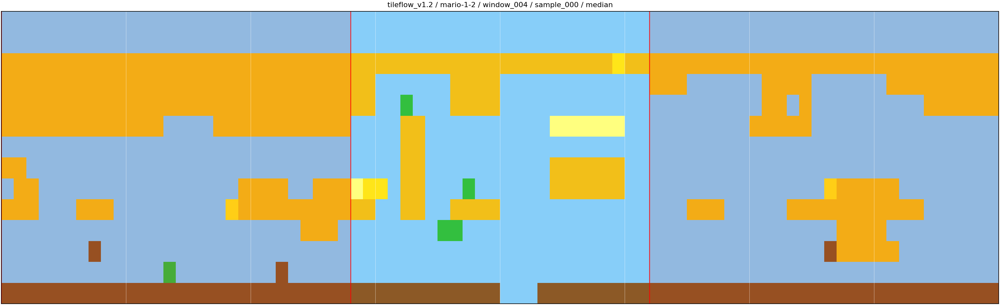 | 2.3305 |
| mario-4-1 | mariodiffusion_full | 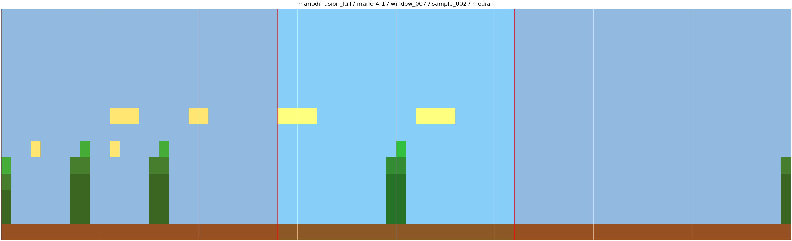 | 1.6116 |
| mario-4-1 | random_fill |  | 27.4746 |
| mario-4-1 | tileflow_v1.2 |  | 1.4860 |
| mario-6-3 | mariodiffusion_full |  | 15.4919 |
| mario-6-3 | random_fill | 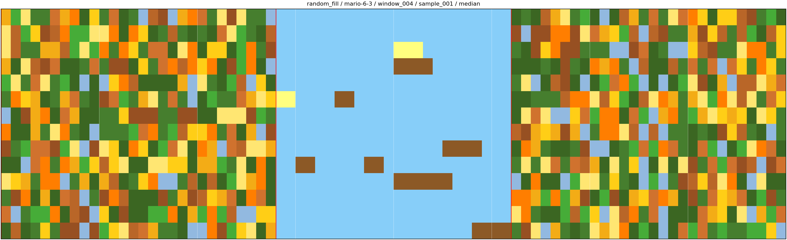 | 28.3496 |
| mario-6-3 | tileflow_v1.2 |  | 16.6468 |

## Appendix Set

| Source | Method | Role | Image | Score |
| --- | --- | --- | --- | --- |
| mario-1-2 | mariodiffusion_full | best | 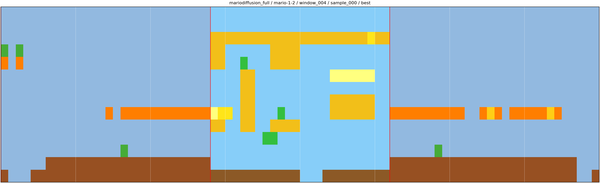 | 3.5306 |
| mario-1-2 | mariodiffusion_full | median | 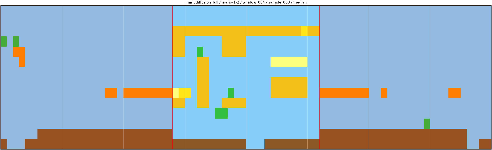 | 3.7681 |
| mario-1-2 | mariodiffusion_full | worst | 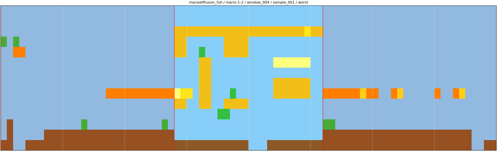 | 3.9351 |
| mario-1-2 | random_fill | best | 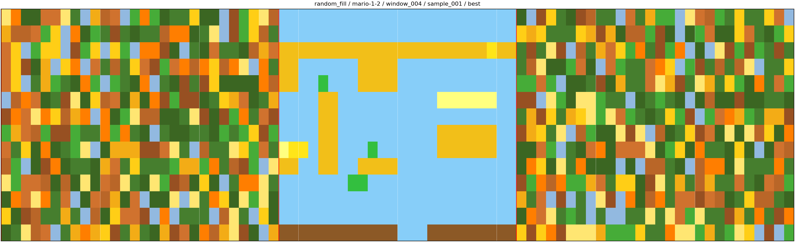 | 22.1503 |
| mario-1-2 | random_fill | median | 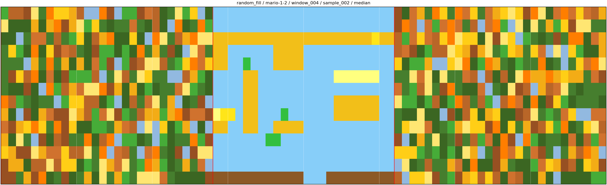 | 23.4198 |
| mario-1-2 | random_fill | worst | 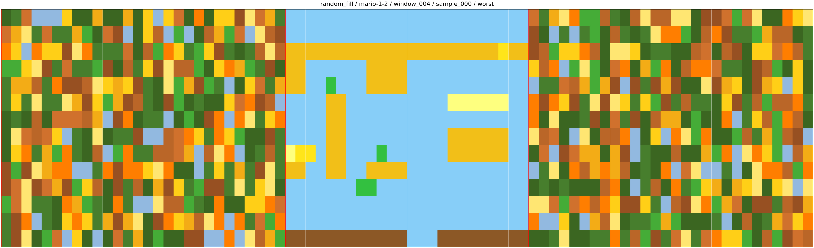 | 24.5995 |
| mario-1-2 | tileflow_v1.2 | best | 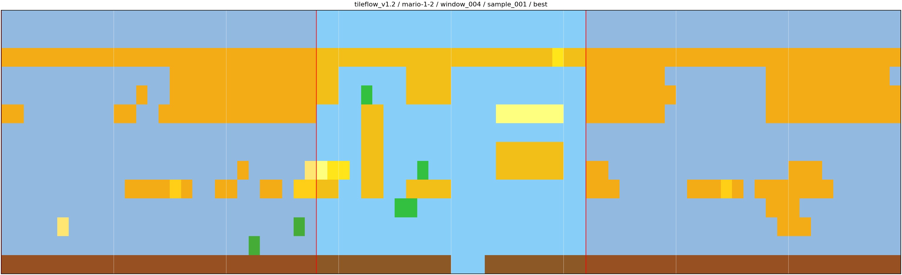 | 1.7190 |
| mario-1-2 | tileflow_v1.2 | median |  | 2.3305 |
| mario-1-2 | tileflow_v1.2 | worst | 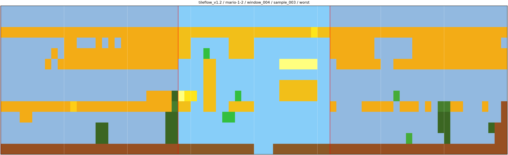 | 3.6629 |
| mario-4-1 | mariodiffusion_full | best | 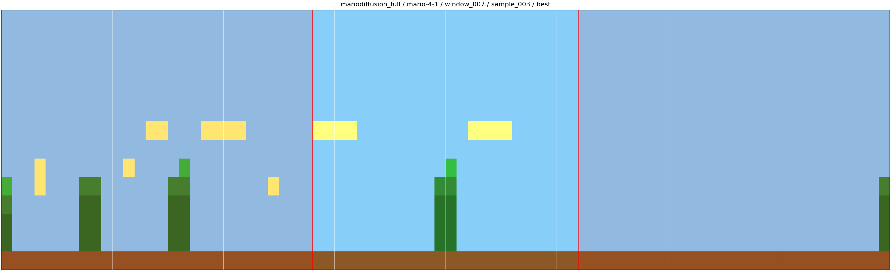 | 1.6091 |
| mario-4-1 | mariodiffusion_full | median |  | 1.6116 |
| mario-4-1 | mariodiffusion_full | worst | 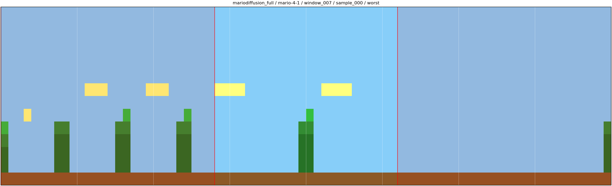 | 1.8156 |
| mario-4-1 | random_fill | best | 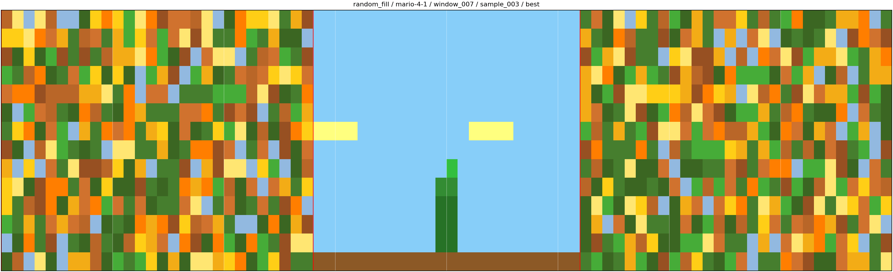 | 26.9695 |
| mario-4-1 | random_fill | median | 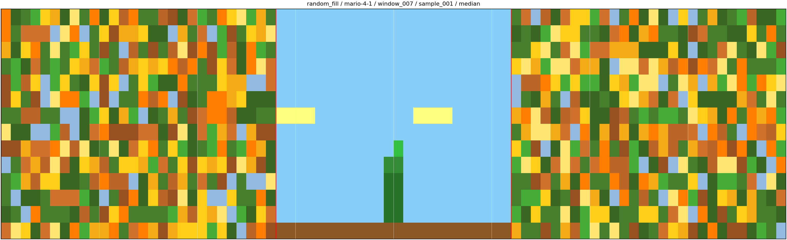 | 27.4746 |
| mario-4-1 | random_fill | worst | 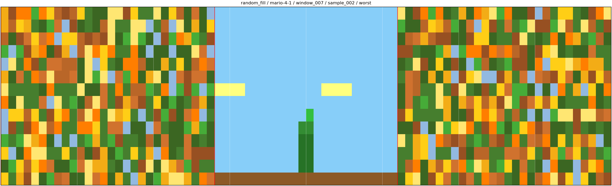 | 29.4080 |
| mario-4-1 | tileflow_v1.2 | best | 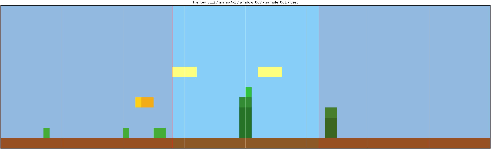 | 0.7618 |
| mario-4-1 | tileflow_v1.2 | median | 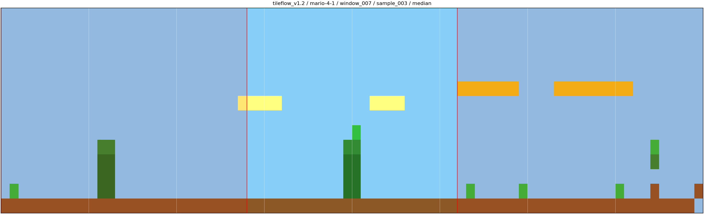 | 1.4860 |
| mario-4-1 | tileflow_v1.2 | worst | 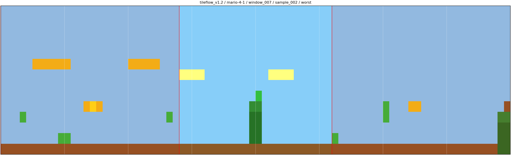 | 1.9269 |
| mario-6-3 | mariodiffusion_full | best | 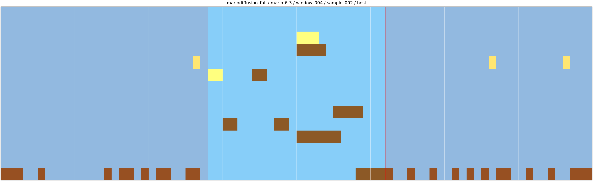 | 15.3457 |
| mario-6-3 | mariodiffusion_full | median | 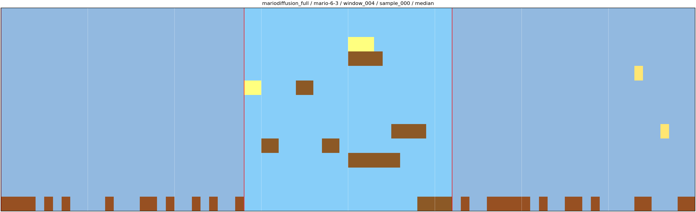 | 15.4919 |
| mario-6-3 | mariodiffusion_full | worst | 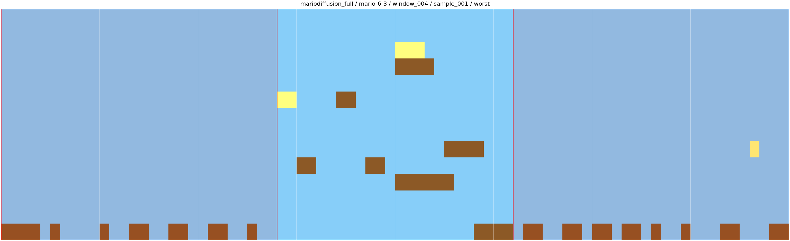 | 15.7203 |
| mario-6-3 | random_fill | best | 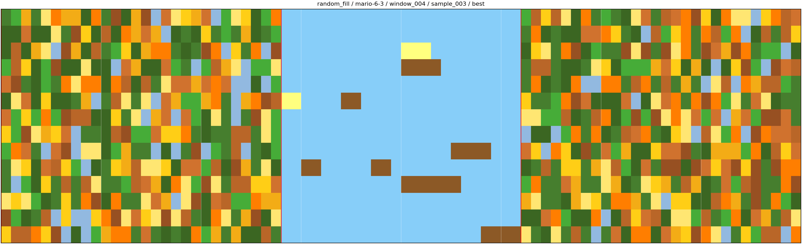 | 27.1880 |
| mario-6-3 | random_fill | median |  | 28.3496 |
| mario-6-3 | random_fill | worst | 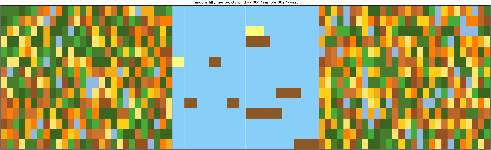 | 28.7622 |
| mario-6-3 | tileflow_v1.2 | best | 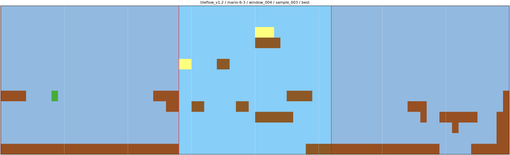 | 4.3347 |
| mario-6-3 | tileflow_v1.2 | median | 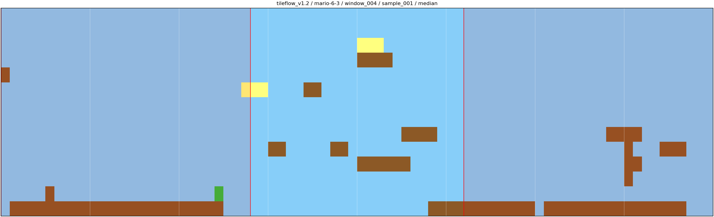 | 16.6468 |
| mario-6-3 | tileflow_v1.2 | worst | 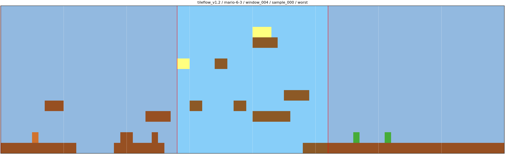 | 16.7766 |
