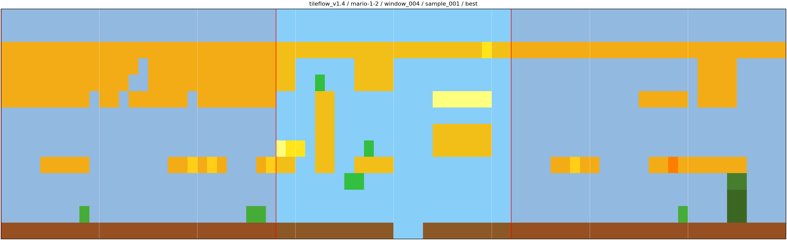
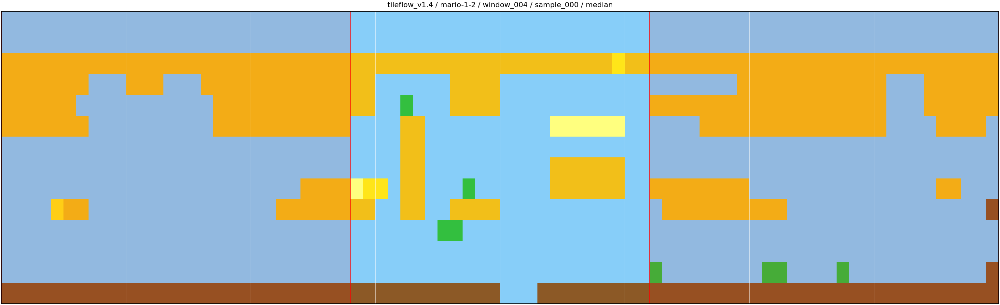
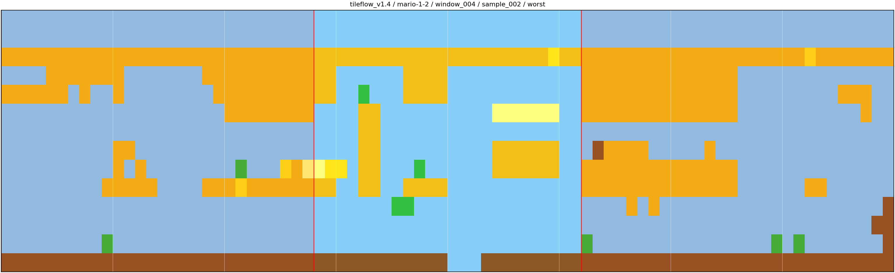
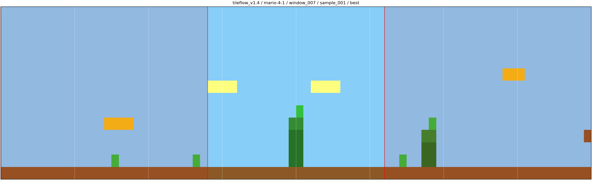
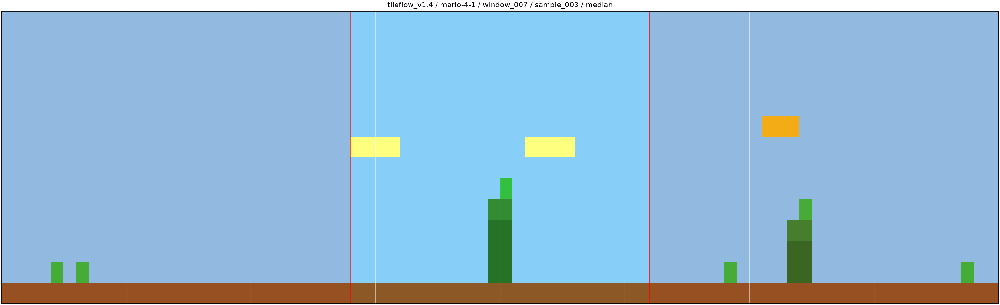
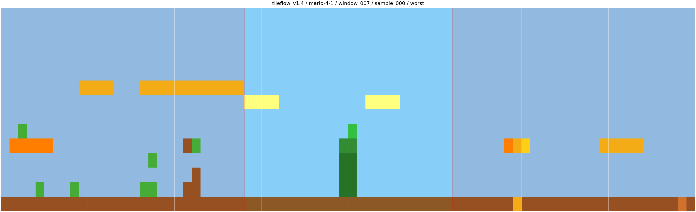
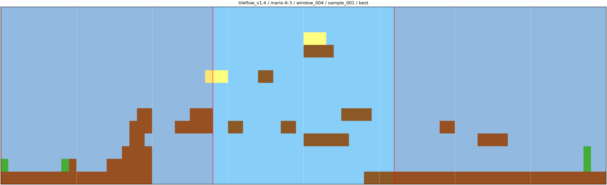
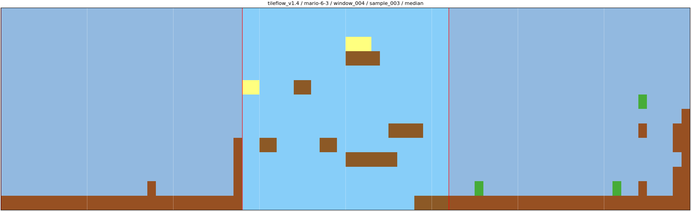
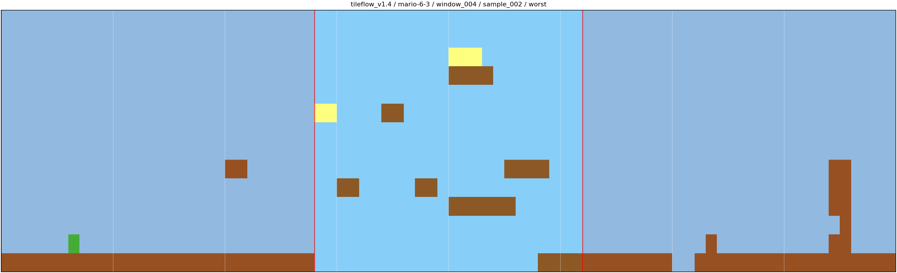

# Benchmark Visual Sets

Generated visual subsets for human inspection. The full benchmark sample
archive remains under each `results/benchmarks/<method>/` directory and is
used for quantitative metrics.

Selection policy:

- `main`: median-quality sample for each method/source pair
- `appendix`: best, median, and worst samples for each method/source pair
- contexts use the same deterministic canonical window per source
- lower selection score is better

## Canonical Windows

| Source | Window |
| --- | --- |
| mario-1-2 | window_004 |
| mario-4-1 | window_007 |
| mario-6-3 | window_004 |

## Main Set

| Source | Method | Image | Score |
| --- | --- | --- | --- |
| mario-1-2 | tileflow_v1.4 |  | 2.2021 |
| mario-4-1 | tileflow_v1.4 |  | 0.7658 |
| mario-6-3 | tileflow_v1.4 |  | 5.7238 |

## Appendix Set

| Source | Method | Role | Image | Score |
| --- | --- | --- | --- | --- |
| mario-1-2 | tileflow_v1.4 | best |  | 1.6967 |
| mario-1-2 | tileflow_v1.4 | median |  | 2.2021 |
| mario-1-2 | tileflow_v1.4 | worst |  | 2.3089 |
| mario-4-1 | tileflow_v1.4 | best |  | 0.6091 |
| mario-4-1 | tileflow_v1.4 | median |  | 0.7658 |
| mario-4-1 | tileflow_v1.4 | worst |  | 2.2838 |
| mario-6-3 | tileflow_v1.4 | best |  | 4.1706 |
| mario-6-3 | tileflow_v1.4 | median |  | 5.7238 |
| mario-6-3 | tileflow_v1.4 | worst |  | 5.9820 |
